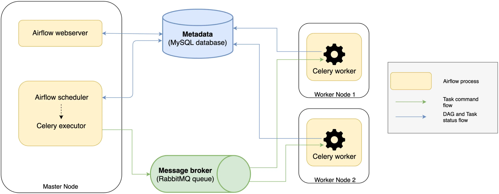

# Airflow

**Apache Airflow是用於數據工程管道的開源工作流管理平台。它於2014年10月在Airbnb開始，作為管理公司日益複雜的工作流程的解決方案。通過創建Airflow，Airbnb可以通過編程方式編寫和計劃其工作流程，並通過內置的Airflow用戶界面進行監控。**
> [Apache Airflow wiki](https://en.wikipedia.org/wiki/Apache_Airflow)

Airflow 是一套用於開發、排程、監控批次處理工作流的開源軟體，其基於 Python 的延展框架令開發者可建置所需的工作流來串接各類技術與服務，監控面則基於 Web 介面來協助管理工作流狀態。

Airflow 的工作流是一套基於 Python 定義的工作流，稱為 Workflows as Code ( WaC )，其設計目的：
+ 動態化 ( Dynamic )：利用 Python 語言設計的工作流可以動態規劃流程，讓流程非固定階段與商業邏輯的規劃
+ 擴展性 ( Extensible )：Airflow 框架提供對各類技術服務提的操作元，任何 Airflow 的元件可輕易傳接服務至所需的流程環境
+ 靈活性 ( Flexible )：工作流運用 [Jinja](https://jinja.palletsprojects.com/en/3.1.x/) 模板來實踐流程參數化設計

## 架構

在 Airflow 中，工作流 ( Workflow ) 等同 [DAG](https://airflow.apache.org/docs/apache-airflow/stable/concepts/dags.html) ( Directed Acyclic Graph ) ，其中包括數個個體工作單元 [Tasks](https://airflow.apache.org/docs/apache-airflow/stable/concepts/tasks.html)，DAG 負責描述 Tasks 間的依賴關係與執行順序，Tasks 則描述自身該做什麼，例如提取資料、分析數據等。

在 Airflow 安裝後，其服務包括一下單元：

+ [Scheduler](https://airflow.apache.org/docs/apache-airflow/stable/concepts/scheduler.html)，主要負責觸發排程中的工作流與提交任務給執行者運行
+ [Executor](https://airflow.apache.org/docs/apache-airflow/stable/executor/index.html)，負責任務的執行者，在預設中 Airflow 的執行是在 Scheduler 中，但在生產或產品環境中，多將任務交給 Worker 執行
+ Webserver，主要負責提供使用者介面來檢視、觸發與除錯 DAG 和 Tasks 的行為
+ DAG 目錄，DAG 檔案存放目錄以提供 Scheduler 與 Executor 讀取並執行
+ Metadata 資料庫，提供 Scheduler、Executor、Webserver 做狀態存儲


## 安裝與執行

參考 [Installation](https://airflow.apache.org/docs/apache-airflow/stable/installation/index.html) 文件，安裝 Airflow 的必要環境是 Apache 與 Python，且安裝文件是基於 Linux 環境，若要運用於不同作業系統，則可考慮使用 [Docker 映像檔](https://airflow.apache.org/docs/docker-stack/index.html) 以服務方式啟動於作業系統。

+ 下載映象檔 [Docker hub - airflow](https://hub.docker.com/r/apache/airflow)

```
docker pull apache/airflow
```

+ 啟動服務

```
docker run -it --rm apache/airflow airflow standalone
```

在 Docker 中，```AIRFLOW_HOME``` 預設在 ```/opt/airflow``` 中，其中 DAG 目錄在 ```/opt/airflow/dags``` 而執行記錄在 ```/opt/airflow/logs```。

+ 使用命令介面 [Command Line Interface Reference](https://airflow.apache.org/docs/apache-airflow/stable/cli-and-env-variables-ref.html)

```
docker exec -ti <container name> airflow info
```

在文獻中，對於 Docker 的運用分為兩篇文獻，一篇是如上所述的 [Docker 命令](https://airflow.apache.org/docs/docker-stack/entrypoint.html#entrypoint-commands) 的操作，適用於開發模式，另一篇為[使用 Docker-Compose 建立分散式應用服務](https://airflow.apache.org/docs/apache-airflow/stable/howto/docker-compose/index.html)，建議使用於產品模式，其主要理由是建議將運算負責的 Executor、管理負責的 Scheduler、介面操作的 Webserver、工作觸法執行的 Triggerer、Metadata 資料庫、緩存服務全部改為獨立的服務容器並分開運作避免單一容器的效率降低與資安風險增加。

不過，對於 Docker-Compose 的設計，Executor、Scheduler、Webserver、Triggerer 實際都是 airflow 容器，以相同容器與設定區分開來運作，並在容器啟動時分別透過命令介面 ```airflow webserver```、```airflow scheduler```、```airflow celery worker```、```airflow triggerer``` 來啟動容器對應的服務內容。

關於單體與分散式運作概念，可以參考以下文獻說明：

+ [Airflow documnet : Celery Executor](https://airflow.apache.org/docs/apache-airflow/stable/executor/celery.html#architecture)
+ [Airflow document : Quick Start](https://airflow.apache.org/docs/apache-airflow/stable/start.html)
+ [Airflow: what do `airflow webserver`, `airflow scheduler` and `airflow worker` exactly do?](https://stackoverflow.com/questions/51063151)
+ [Apache Airflow：工作流程管理控制台](https://tech.hahow.in/4dc8e6fc1a6a)


> Reference : [How Apache Airflow Distributes Jobs on Celery workers](https://medium.com/sicara/54cb5212d405)

由上圖與文獻所述，Airflow 的啟動是需要透過命令介面執行不同命令來開啟相對應服務，在適用開發模式的單體容器 ( Standalone )，雖然使用 ```airflow standalone```，但實際上內部仍是呼叫多個命令工作，而在產品模式的分散式結構中，則是各容器各自執行命令，在透過 Metadata 資料庫、Redis 緩存來進行 DAG 狀態改變，從而觸發各服務的運作。

基於前述，本專案在安裝與啟動設計也區分為二，並依據需要建立如下對應命令介面：

#### 開發模式

```
airflow dev up
airflow dev down
airflow dev into
```

#### 產品模式

```
airflow prd up
airflow prd down
airflow prd cli -c="airflow info"
```
> 產品模式使用的[設定檔](https://airflow.apache.org/docs/apache-airflow/2.5.0/docker-compose.yaml)來源於官方文件並進行適度修改，例如關閉下載範例、調整目錄位置等。

## 設計

+ [基於 DAG 的基礎設計](./docs/tutorial-dag.md)
+ [基於 TaskFlow 的函數導向設計](./docs/tutorial-taskflow.md)
+ [群組化工作流設計](./docs/tutorial-groups.md)
+ [基於資料建立資料庫 - airflow document](https://airflow.apache.org/docs/apache-airflow/stable/tutorial/pipeline.html)
    - 此範例說明如何讀取 CSV 檔案並對 Postgres SQL 資料庫建立資料表與匯入資料
+ [任務間通訊 XComs ( cross-communications )](./docs/tutorial-xcoms.md)
+ [執行 DAG - airflow document](https://airflow.apache.org/docs/apache-airflow/stable/core-concepts/dag-run.html)
    - 使用基於 [cron expression](https://en.wikipedia.org/wiki/Cron#CRON_expression) 觸發的 schedule
    - 透過 AirFlow CLI 執行 [Backfill](https://airflow.apache.org/docs/apache-airflow/stable/core-concepts/dag-run.html#backfill) 與 [Triggers](https://airflow.apache.org/docs/apache-airflow/stable/core-concepts/dag-run.html#external-triggers)
    - 使用 WebUI 來執行執行 Trigger
+ [使用者介面 - airflow document](https://airflow.apache.org/docs/apache-airflow/stable/ui.html)、[Airflow User Interface: 5 Critical Components](https://hevodata.com/learn/airflow-user-interface/)
    - DAGs View 是用來呈現所有 DAG 的狀態，若要過濾 DAG 則可使用 DAG 定義的標籤 ( Tag ) 篩選
        + Runs、Recent Tasks 欄位下面的圓圈代表著此 DAG 與 DAG 中 Task 的執行狀態與次數
    - Datasets View 是用來呈現 DAG 產生的資料集關係圖
    - Grid View 是用來呈現 DAG 的執行狀態，細節面板可以顯示單次 DAG 執行的狀態細節，亦可選擇單次 DAG 中的任務來查看任務的細節資訊
    - Graph View  是用圖像呈現 DAG 中任務的關係圖
    - Calendar View 是使用日曆形式來呈現 DAG 在整年中執行的狀況
    - Variable View 是呈現整個 AirFlow 中可使用的全域變數資訊
+ [Providers](./docs/tutorial-provider.md)
    - [docker provider](./docs/tutorial-provider-docker.md)

## 文獻

+ [Airflow Document](https://airflow.apache.org/docs/)
    - [Overview](https://airflow.apache.org/docs/apache-airflow/stable/index.html)
    - [Architecture Overview](https://airflow.apache.org/docs/apache-airflow/stable/concepts/overview.html)
        + [Concepts](https://airflow.apache.org/docs/apache-airflow/stable/concepts/index.html)
        + [Apache Airflow Architecture](https://towardsdatascience.com/496b9cb28288)
    - [Quick Start](https://airflow.apache.org/docs/apache-airflow/stable/start.html)
        + [Installation](https://airflow.apache.org/docs/apache-airflow/stable/installation/index.html)
    - [Integration](https://airflow.apache.org/docs/apache-airflow/stable/integration.html)
    - [Providers Packages](https://airflow.apache.org/docs/apache-airflow-providers/index.html)
        + [Providers list](https://airflow.apache.org/docs/#providers-packagesdocsapache-airflow-providersindexhtml)
+ Introduction
    - [An introduction to Apache Airflow](https://docs.astronomer.io/learn/intro-to-airflow)
    - [What Is Apache Airflow?](https://www.run.ai/guides/machine-learning-operations/apache-airflow)
    - [Three Helpful Tips to Know Before Choosing Apache Airflow As a Workflow Management Platform](https://towardsdatascience.com/42dc4073ae11)
+ Docker
    - [apache/airflow](https://hub.docker.com/r/apache/airflow)
    - [docker](https://hub.docker.com/_/docker)
    - [r-base](https://hub.docker.com/_/r-base)
    - [tensorflow](https://www.tensorflow.org/install/docker?hl=zh-tw)
    - [scikit-learn-intel](https://hub.docker.com/r/bitnami/scikit-learn-intel)
    - [pytorch](https://hub.docker.com/r/pytorch/pytorch)
