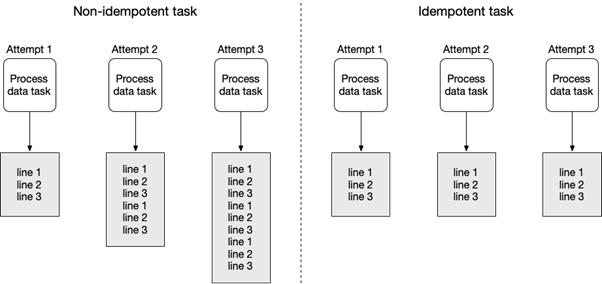

# 交叉通訊 ( XComs，cross-communications )

+ [XComs](https://airflow.apache.org/docs/apache-airflow/stable/core-concepts/xcoms.html)
    - [example_xcom - airflow github](https://github.com/apache/airflow/blob/main/airflow/example_dags/example_xcom.py)
    - [範例程式 - taskgroups](../dags/tutorial_taskgroup.py)
+ 文獻
    - [Pass data between tasks](https://docs.astronomer.io/learn/airflow-passing-data-between-tasks)
    - [Python & Airflow 學習筆記_Operator 間的參數傳遞 XCom](https://ithelp.ithome.com.tw/articles/10286881)
    - [Airflow XCom - DAG 的 Task 資料溝通](https://sean22492249.medium.com/airflow-xcom-dag-%E7%9A%84-task-%E8%B3%87%E6%96%99%E6%BA%9D%E9%80%9A-4bdf9329e970)

## 簡介

在 AirFlow 文獻中，對於任務間 ( Task ) 的資料傳遞有兩種建議方式，其差異在於資料規模。

+ XComs，用於參數與設置數據，這些數據屬於工作流程的一種狀態值，其數值的存在會改變工作流程對於演算、運作的根本性改變。
+ tempfile，用於演算數據等巨量資料，屬於工作流程本身需處裡的資料，這類數據應從如資料庫或資料倉儲庫提取，經過計算的暫存可以緩存於本地或遠端資料儲存庫。
    - [tempfile 生成臨時檔案和目錄 - Python 3 document](https://docs.python.org/zh-tw/3/library/tempfile.html)
    - [Apache Airflow for Data Science — How to Upload Files to Amazon S3](https://towardsdatascience.com/5bdf6fcb1cea)  
        + [Does temporary files created exist across tasks in an airflow DAG](https://stackoverflow.com/questions/73655345)
        + AirFlow 的規劃中，Task 可以運行於不同的 Executor，而其中不乏雲端服務如 kubernetes，在這些執行環境會因為分散運算導致容器間不是共通環境；因此，在這些環境中運行時，需要配合其他雲端儲存服務來保存暫存檔案。

由於 AirFlow 建議各任務 ( Task ) 需保持獨立性 ( 高內聚、低耦合 )，並保持 [idempotent](https://william-yeh.net/post/2020/03/idempotency-key-test/)，其目的是確保流程的穩定與資料正確性，更有避免出現 race condition 等衝突。


> [Figure 3.9 An idempotent task produces the same result, no matter how many times you run it. Idempotency ensures consistency and ability to deal with failure.](https://livebook.manning.com/concept/apache-airflow/idempotent-task)

然而，即使如此在任務間仍有無法避免的共通數據傳遞，如配置設定、前個任務狀態等，若有此類資訊傳遞必要則可利用 XComs 來進行資訊傳遞；需要注意，由於前述文獻中的範例部分使用 AirFlow v1.0，其中 [PythonOperator](https://airflow.apache.org/docs/apache-airflow/stable/howto/operator/python.html) 於現在官方文件是建議改用 ```@task``` 裝飾函數替代，因此，如 ```provide_context=True``` 也已經移除。

## XComs 操作

在 XComs 操作中有三個主要的操作

+ ```xcom_push```，以 key-value 的方式寫入資料到 XCom
+ ```xcom_pull```，以 key-value 的方式從 XCom 中取得資料
+ ```do_xcom_push```，在 Operators 或 TaskFlow 生成任務物件時設定，其 return 內容是否自動寫入 XCom，在預設情況下為 True

對於 ```xcom_push```、```xcom_pull``` 的操作需要取得 TaskInstance 物件，在 Operators 與 TaskFlow 的取得方式分別如下：

+ Operators

以 BashOperator 為例，由於 Operator 多數行為已經封裝，但仍保有使用 [Jinja Templating](https://airflow.apache.org/docs/apache-airflow/2.2.4/concepts/operators.html#jinja-templating) 的操作，因此，透過 [Airflow 樣板變數](https://airflow.apache.org/docs/apache-airflow/stable/templates-ref.html) ```{{ti}}``` 即可對 XCom 物件進行操作並存取資料。

```
bash_push = BashOperator(
  task_id="bash_push",
  bash_command='echo "bash_push demo"  && '
  'echo "Manually set xcom value '
  '{{ ti.xcom_push(key="manually_pushed_value", value="manually_pushed_value") }}" && '
  'echo "value_by_return"',
)
```

+ TaskFlow

由於 ```@task``` 本身設計是以 functional 程式設計考量，在設計常會看到如 ```task1 ( task2() )``` 的工作流程設計，因此，狀態變數等資訊本就是透過函數的傳遞參數轉導，在官方文獻對 [TaskFlow 在 AirFlow 2.0 概念](https://airflow.apache.org/docs/apache-airflow/stable/tutorial/taskflow.html#but-how) 提到以此方式是用來替代取得 TaskInstance 後存取 XCom 的繁瑣方式，但實務上仍有三個方式取得 TaskInstance。

[Operator 與 TaskFlow 之間的交互使用](https://airflow.apache.org/docs/apache-airflow/stable/tutorial/taskflow.html#adding-dependencies-between-decorated-and-traditional-tasks)，此方式是透過 Operator 回傳讓 Task 取得其回傳內容中的輸出，亦即儲存於 XCom 中的內容。

```
get_api_results_task = SimpleHttpOperator(
    task_id="get_api_results",
    endpoint="/api/query",
    do_xcom_push=True,
    http_conn_id="http",
)

@task
def parse_results(api_results):
    return json.loads(api_results)

parse_results(api_results=get_api_results_task.output)
```

[TaskFlow 本身運用 Jinja 樣板變數](https://airflow.apache.org/docs/apache-airflow/stable/tutorial/taskflow.html#accessing-context-variables-in-decorated-tasks)，此方式則是當 TaskFlow 被執行時，AirFlow 會以反轉相依的概念將 Jinja 樣板變數傳遞進入函數。

```
# 清晰定義所需變數
@task
def my_python_callable(ti=None, next_ds=None):
    pass

# 透過 kwargs 變數
@task
def my_python_callable(**kwargs):
    ti = kwargs["ti"]
    next_ds = kwargs["next_ds"]
```

[airflow.operators.python 的 get_current_context 函數](https://airflow.apache.org/docs/apache-airflow/2.2.4/_api/airflow/operators/python/index.html#airflow.operators.python.get_current_context)，此方式是當目前執行的程式要避開使用前述的方式，但仍有必要取得 context 時使用，但若執行當下不存在 task 運行，則會發生異常；若考慮任務的設計需要，此方式並不是值得運用的方法。

```
from airflow.operators.python import get_current_context

def some_function_in_your_library():
    context = get_current_context()
    ti = context["ti"]
```

## XComs vs Variable

在 AirFlow 中有一個 [Variable](https://airflow.apache.org/docs/apache-airflow/stable/core-concepts/variables.html) 模組可供用來儲存，但在使用上有一下描述。

**Variables are global, and should only be used for overall configuration that covers the entire installation; to pass data from one Task/Operator to another, you should use XComs instead.**

在規範上 Variable 屬於全域，甚至是整個 AirFlow 都在使用，因此若是在任務之間的設定與狀態應採用 XCom，反之若是跨 DAG 共通的設定才應該利用 Variable。
